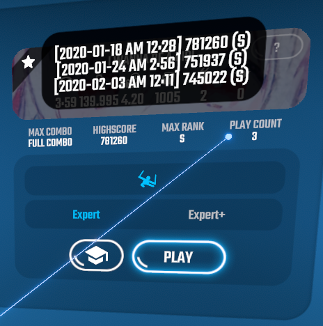

# SongPlayHistory

Track all your scores.

## Screenshot

## Features

- Keep detailed track of your plays
- Show how many times you've played a single beatmap
- Visualize your song preferences (👍/👎)

## Installation

- Copy [SongPlayHistory.dll](https://github.com/swift-kim/SongPlayHistory/releases) to Beat Saber's _Plugins_ directory (Requires _BS Utils_, _BeatSaberMarkupLanguage_)
- Also available on [BeatMods](https://beatmods.com/#/mods) (Use [ModAssistant](https://github.com/Assistant/ModAssistant))

## Notes

- Recording play data begins when you first install this plugin. (This doesn't apply to play counts.)
- The data file (_SongPlayData.json_) is created in Beat Saber's _UserData_ directory. You can delete individual records from there if you want.
- The data are not uploaded anywhere so you have to **backup** the file when re-installing the game.
- If you run into any problem, please contact me either via Discord _(peperoro#1013)_ or by filing an issue.
